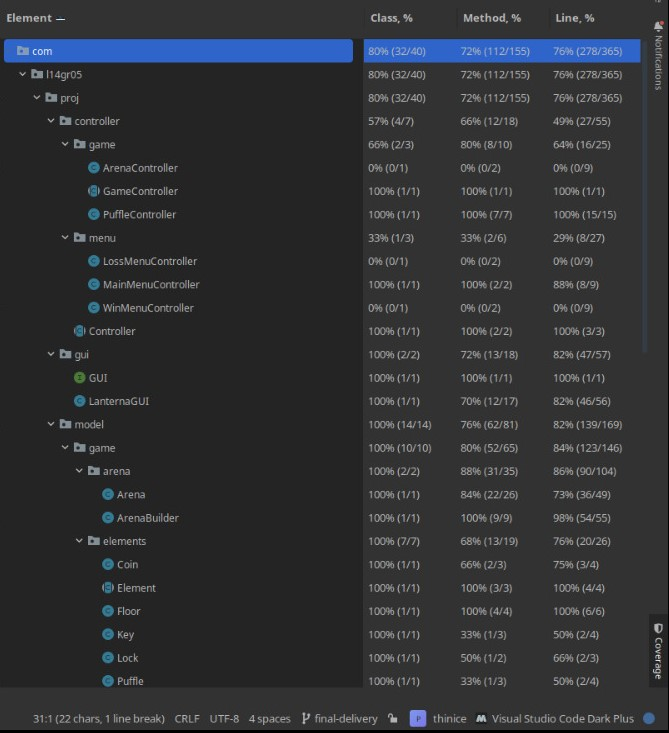
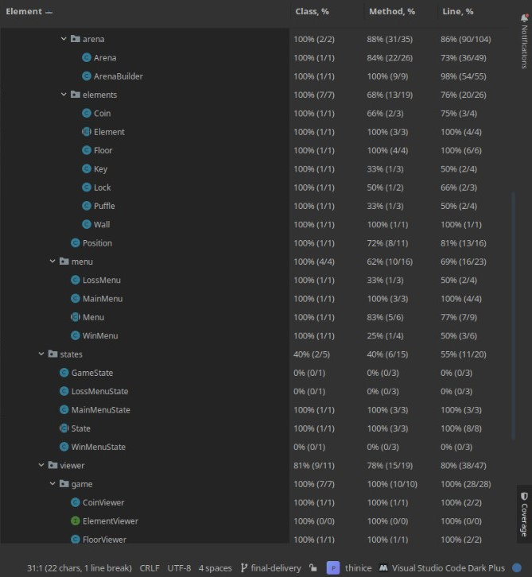
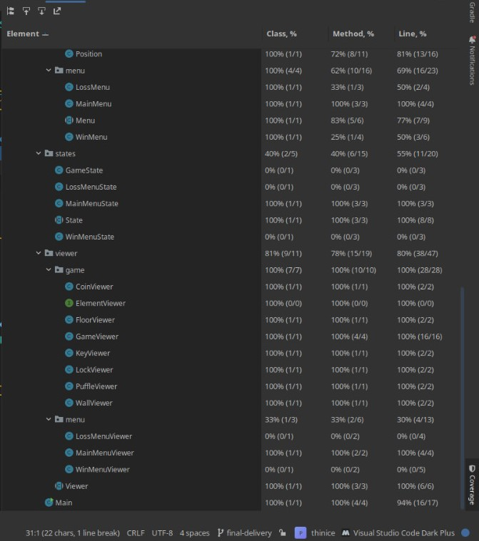

## LDTS_T14G05 - THIN ICE

THIN ICE is a game where the player must control a Black Puffle that is on fire through a maze of ice, melting as many ice squares as possible along the way.
Reach the red square in each maze to advance to the next level, but careful, if you find yourself with no other ice square to move to, you will drown!

This project was developed by *Bernardo Campos* (up202006056@up.pt), *Inês Miranda* (up202108775@up.pt) and *José Santos* (up202108673@up.pt) for LDTS 2022⁄23.

### IMPLEMENTED FEATURES

- **Passage of levels** - The player needs to find the path to a red square in each level, by reaching progressing to the next level.
- **Ice durability** - Depending on the durability of each ice square, after a player moves from it, it will melt, turning into thinner ice or water.
- **Points count** - Every ice square melted to water will grant some points. This is to motivate the player to melt every square in each level, making the game more challenging.
- **Condition to lose** - The player can not move to walls or water. If the player is surrounded exclusively by walls and water, with nowhere else to move, it is game over.
- **Coins** - There are coins in the map for the player to pick up.
- **Keys and Locks** - Sometimes the path will be blocked by a lock. To unlock it, the player must first pick up a key located somewhere in the map.
- **Levels** - The game has five levels, as the player pass the levels the difficulty increases.
- **Player Movement** - The player is able to move using WASD, limited to the borders of the map and *conditions* of the floor.

### PLANNED FEATURES
- **Creation of Portals** - The puffle would be able to enter a portal and appear in the other side of it.

### DESIGN

#### General Structure
- **Problem in Context** - We decided to use the Model-View-Controller pattern as it is the most commonly used architectural pattern for developing GUI applications like ours. 
- **The Pattern** - The Model-View-Controller is an architectural pattern that divides an application into three parts. The model is responsible for representing the data (the elements of the game, i.e. walls, puffle, etc.), the view displays the data and sends user actions to the controller, the controller provides data to the view and interprets user actions.
- **Implementation** - The classes corresponding to the model, the view and the controller are divided into separate folders in our source code. Each *Element* class of the Model has its respective viewer class. 
- **Consequences** - By using this design pattern, we were able to achieve low coupling amongst models, views or controllers, ease of modification, high cohesion and the code remains organized, since the classes are clearly divided by their function.

### CODE SMELLS AND REFACTORING
- **Bloater (Long Parameter List)** - In class Arena there is more than three parameters for a method. However, if we get rid of that parameters it would cause unwanted dependencies between classes.
- **Lazy Class and Data class** - Some of our classes of elements are only there because the element needs to exist, which is the case in coin, key and lock which have no behavior. This is something caused by the MVC and the organization structure we chose to our project.

### TESTING

#### Coverage Report

