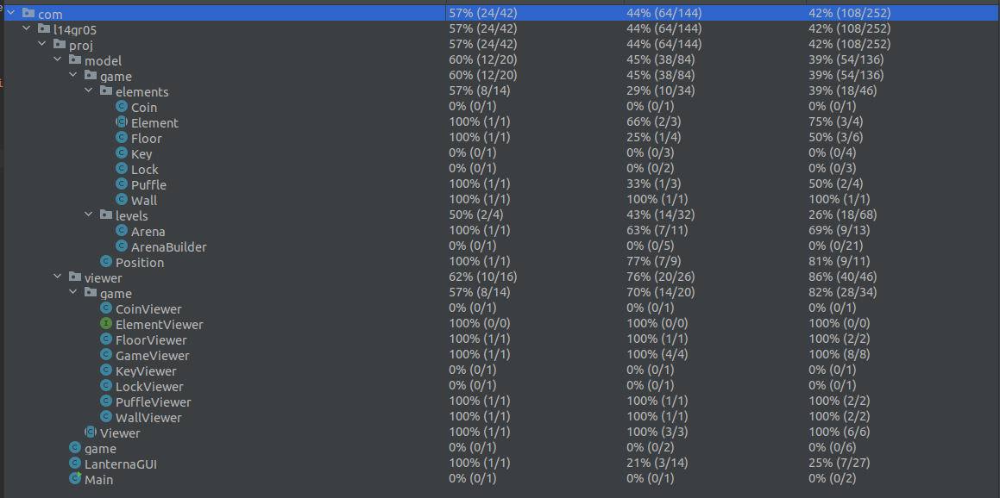

## LDTS_T14G05 - THIN ICE

THIN ICE is a game where the player must control a Black Puffle that is on fire through a maze of ice, melting as many ice squares as possible along the way.
Reach the red square in each maze to advance to the next level, but careful, if you find yourself with no other ice square to move to, you will drown!

This project was developed by *Bernardo Campos* (up202006056@up.pt), *Inês Miranda* (up202108775@up.pt) and *José Santos* (up202108673@up.pt) for LDTS 2022⁄23.

### IMPLEMENTED FEATURES

- The game is still in its early development, so the implementation is limited to the Model and View. The *game* is currently a static image showcasing the implement elements.

### PLANNED FEATURES

- The player will be able to move using WASD, limited to the borders of the map and *conditions* of the floor.
- We plan to build at least a few levels to the game.
- The player needs to find the path to a red square in each level, by reaching progressing to the next level.
- Depending on the durability of each ice square, after a player moves from it, it will melt, turning into thinner ice or water.
- The player can not move to walls or water. If the player is surrounded exclusively by walls and water, with nowhere else to move, it is game over.
- Every ice square melted to water will grant some points. This is to motivate the player to melt every square in each level, making the game more challenging.
- There are coins in the map for the player to pick up.
- Sometimes the path will be blocked by a lock. To unlock it, the player must first pick up a key located somewhere in the map.

### DESIGN

#### General Structure
- **Problem in Context.** We decided to use the Model-View-Controller pattern as it is the most commonly used architectural pattern for developing GUI applications like ours. 
- **The Pattern.** The Model-View-Controller is an architectural pattern that divides an application into three parts. The model is responsible for representing the data (the elements of the game, i.e. walls, puffle, etc.), the view displays the data and sends user actions to the controller, the controller provides data to the view and interprets user actions.
- **Implementation.** The classes corresponding to the model, the view and (when implement) the controller are divided into separate folders in our source code. Each *Element* class of the Model has its respective viewer class. 
- **Consequences.** The code remains organized, since the classes are clearly divided by their function.

### TESTING

#### Coverage Report

As concluded by the following picture, the testing for the game is still very incomplete.

